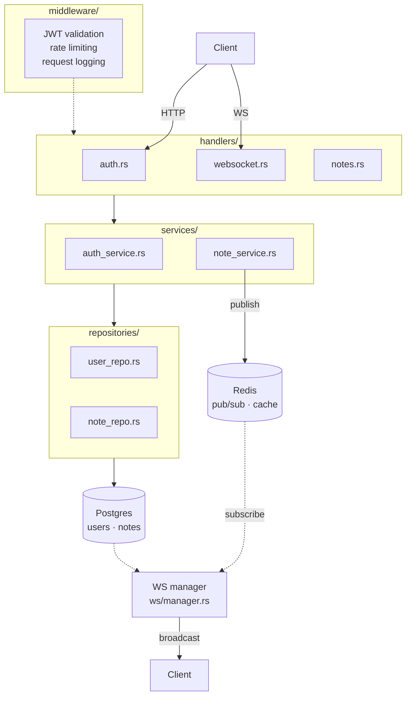

# 🧠 Real-time Collaborative Notes API

A Rust backend demonstrating production-ready patterns: layered architecture, JWT auth, WebSocket real-time sync, Redis pub/sub, and Postgres persistence.

> **Purpose:** Portfolio project targeting a TypeScript/Rust startup role. Goal is to demonstrate ability to pick up a new language (Rust) and produce clean, scalable, interview-worthy code.

---

## 🎯 Core idea

A backend that supports:

- Multiple users editing notes
- Real-time updates via WebSockets
- Persistent storage
- Auth + permissions

Think: mini Notion backend (without overengineering it)

---

## 🏗️ Architecture



### Layers

```
handlers (HTTP / WS)
↓
services (business logic)
↓
repositories (DB access)
↓
database (Postgres)
```

### Key components

| Component              | Technology                  |
| ---------------------- | --------------------------- |
| API + WebSocket server | Rust / Axum                 |
| Database               | Postgres via sqlx           |
| Cache + pub/sub        | Redis                       |
| Auth                   | JWT (jsonwebtoken + argon2) |
| Async runtime          | tokio                       |
| Logging                | tracing                     |

---

## 🧱 Folder structure

```
src/
  main.rs

  handlers/
    auth.rs
    notes.rs
    websocket.rs

  services/
    auth_service.rs
    note_service.rs

  repositories/
    user_repo.rs
    note_repo.rs

  models/
    user.rs
    note.rs

  middleware/
    auth.rs

  ws/
    manager.rs   // connection tracking
    messages.rs

  config.rs
  error.rs
```

---

## 📦 Feature scope

### 1. Authentication

- Register / login
- Password hashing (`argon2`)
- JWT-based auth middleware
- JWT extractor implemented as a proper Axum `FromRequestParts` — idiomatic Rust, signals familiarity with the framework

**Endpoints**

```
POST /auth/register
POST /auth/login
```

### 2. Notes CRUD

- Create / update / delete note
- Get notes (paginated)

**Schema**

```
users
  - id
  - email
  - password_hash

notes
  - id
  - user_id
  - title
  - content
  - updated_at
  - version       ← optimistic locking
```

### 3. Real-time updates

**Flow**

1. Client connects via WebSocket
2. Subscribes to a note
3. On update:
   - Save to DB
   - Publish event to Redis
   - WS manager broadcasts to all connected clients

**Endpoint**

```
GET /ws?note_id=123
```

**Message format**

```json
{
  "type": "update",
  "content": "new content",
  "userId": "abc"
}
```

**Why Redis pub/sub (not in-memory broadcast)?**

- Enables horizontal scaling across multiple API instances
- Decouples the update path from the WebSocket layer
- Demonstrates understanding of distributed systems — do this properly from the start, not as an afterthought

### 4. Middleware

- JWT validation
- Rate limiting (basic)
- Request logging (`tracing`)

---

## 🔄 Data flow: update note (interview gold)

```
HTTP request
  → handler validates input
  → calls note_service
  → note_service updates DB (with optimistic lock check)
  → note_service publishes event to Redis
  → WS manager (subscribed to Redis) broadcasts to connected clients
```

---

## ⚡ High-signal extras (implement at least 2)

- [x] **Optimistic locking** — `version` field on notes, reject stale writes
- [ ] **Background worker** — activity log processor via `tokio::spawn`
- [x] **Redis caching** — cache note reads, invalidate on update
- [ ] **OpenAPI docs** — `utoipa` crate
- [x] **Docker setup** — see Phase 1, done early intentionally

---

## 🧪 Testing

- Unit tests for service layer logic
- Integration tests for HTTP endpoints
- Even a small suite is a strong signal — don't skip

---

## ⏱️ Build plan

### Phase 1 — Scaffold + Docker (days 1–2)

Get the foundation right before writing business logic.

- [ ] `cargo new`, folder structure in place
- [ ] `docker-compose.yml` with `api`, `postgres`, `redis` — **do this now, not at the end**
- [ ] Basic Axum server, `GET /health` returning 200
- [ ] Live `PgPool` passed as Axum state
- [ ] sqlx migrations scaffolded, `cargo sqlx prepare` run, `sqlx-data.json` committed
- [ ] `tracing` initialised

> **Why Docker early?** Eliminates "works on my machine" problems, makes the deploy step at the end trivial, and forces clean config/env handling from day one.

**`docker-compose.yml` target:**

```yaml
services:
  api:
    build: .
    ports: ["3000:3000"]
    depends_on: [postgres, redis]
  postgres:
    image: postgres:16
    environment:
      POSTGRES_PASSWORD: password
      POSTGRES_DB: notes
  redis:
    image: redis:7
```

---

### Phase 2 — Auth + Notes CRUD (days 3–5)

- [ ] `POST /auth/register` and `POST /auth/login` end-to-end
- [ ] `argon2` password hashing
- [ ] JWT generation and `FromRequestParts` extractor middleware
- [ ] Notes CRUD endpoints with pagination
- [ ] User and note repositories using `sqlx`
- [ ] Unit tests for `auth_service` and `note_service`

---

### Phase 3 — WebSockets + Redis pub/sub (days 6–9)

Implement real-time properly — Redis from the start, not in-memory first.

- [ ] `GET /ws?note_id=123` endpoint
- [ ] WS connection manager (`ws/manager.rs`) tracking connected clients per note
- [ ] Redis pub/sub: `note_service` publishes on update, manager subscribes and broadcasts
- [ ] Redis caching for note reads with invalidation on write
- [ ] Optimistic locking via `version` field
- [ ] Rate limiting middleware
- [ ] Integration tests for WS and HTTP endpoints

---

### Phase 4 — Deploy + Polish (days 10–11)

- [ ] Deploy to Railway / Fly.io / Render with managed Postgres + Redis
- [ ] README written (see below)
- [ ] Architecture decision log written (see below)
- [ ] OpenAPI docs via `utoipa` (stretch)
- [ ] Basic frontend (stretch)

---

## 📝 README requirements

The README should tell a story, not just list endpoints. Include:

- **What it is** — one paragraph, plain English
- **Architecture diagram** — embed the Mermaid diagram
- **Setup instructions** — `docker-compose up` should be the main path
- **API reference** — endpoints, auth flow, WS message format
- **Rust learnings section** — written honestly:
  - What transferred from TypeScript (async/await mental model, type safety instincts)
  - What surprised me (ownership/borrow checker, trait system vs interfaces, `Result`/`Option` ergonomics)
  - What I'd do differently next time
- **Architecture decision log** — see below

---

## 🗂️ Architecture decision log

Document each significant choice in the README or a separate `DECISIONS.md`:

| Decision  | Options considered             | Choice     | Reason                                                                          |
| --------- | ------------------------------ | ---------- | ------------------------------------------------------------------------------- |
| Framework | Actix-web, Axum                | Axum       | Tokio-native, composable extractors, better ergonomics for layered architecture |
| ORM / DB  | Diesel, sqlx                   | sqlx       | Async-first, compile-time query checking, no heavy ORM abstraction              |
| Auth      | Sessions, JWT                  | JWT        | Stateless, scales horizontally, fits the distributed architecture               |
| Pub/sub   | In-memory broadcast, Redis     | Redis      | Multi-instance ready from day one; in-memory would need replacing later         |
| Real-time | Server-sent events, WebSockets | WebSockets | Bidirectional needed for collaborative editing                                  |

Add entries as decisions are made during the build.
